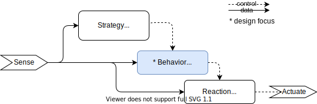
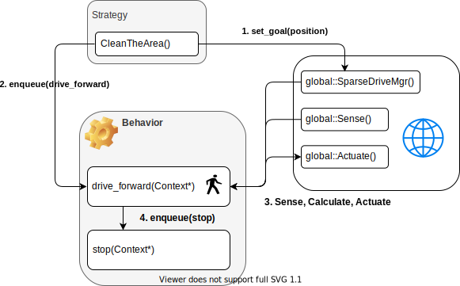
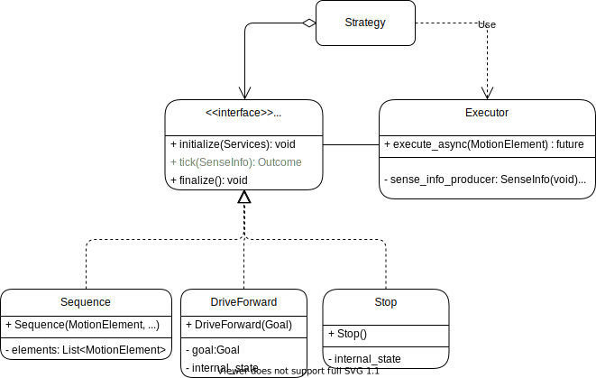
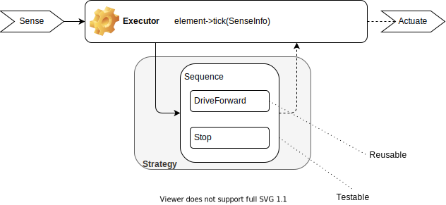

<!-- headingDivider: 2 -->

# RVC Behavior Re-Design

**Sam Rud** (Rude)

Principal Software Engineer
Head Robot Navigation Software Architect


## About Me
- school
- past work
- get to know you

## What to Expect

* Overview of the legacy design
* Introduce the design problem
* Propose a solution and the approach
* Solving a detailed requirement

# RVC Architecture

Based on Subsumption Architecture



## Behavior Design



## Taking issue

| No. | Issue | Remedy (Requirement) |
| --- |------- |----------------- |
| 1   | Mutable Inputs and Parameters | A Behavior shall be provided clear, immutable sensor data. Sensor data shall be passed to the Behavior |
| 2   | Shared global data  | A Behavior shall encapsulate and manage its state and resources. |
| 3   | Actuator command is not guaranteed | A Behavior shall return the actuator command as an outcome of it execution. |

## Taking issue

| No. | Issue | Remedy (Requirement) |
| --- |------- |----------------- |
| 4   | Difficult to comprehend depth of behavior | Behaviors shall be composable prior to execution and frozen during execution. e.g. behavior tree |
| 5   | Unit and integration tests unattainable | Behaviors (singular or composite) must be individually testable as a unit and as a simulated integration test.  |

## Additional Requirements

* Backwards compatible
* Able to accommodate other methods of execution - state machines, behavior trees
* Maintain periodic execution

## Proposed Design (UML)



## Proposed Design (Interaction)



## Conclusions

Next Steps - ROS 2 integration, Porting or Wrapping Legacy Behaviors

Tradeoffs - TBD, Why not just a Behavior Tree?

# Managing Behavior-Reaction interaction through Static-Polymorphism

## Problem

At any given time, a Behavior can request to disable a reaction. A common problem is the reaction is not re-enabled for future behaviors leading to situations where the robot can become stuck or may not be able to complete a cleaning mission.

## Solutions

Round 1
- RAII techniques to ensure reactions are re-enabled after the behavior ends. 
    - In the Behavior Element, disable reactions in the element's initialize and re-enable in the element's finalize
- Requires behaviors to specify at run-time what reactions to enable and disable.
- Unfortunately, need to wait for unit, integration, and system testing to verify that the reactions to disable are specified correctly.

Round 2

Use compilation-time techniques to force developers to specify the reaction specification. We took advantage of the Curiously Recurring Template Pattern to create a static polymorphic interface to define the reaction specification and validate it at compile-time. If a developer did not complete the specification, the build breaks.

## Conclusions

* Using CRTP as an interface provides additional performance as virtual methods are forgone.
* Developers can concentrate on implementing the behavior and not rationalizing how to handle reactions.

## See the Code


# Appendix

# Proposed Design Notes

Behavior Element, a C++ Interface providing
- internal state
- immutable sensor input
- guaranteed actuator command,
- composable expressions

Asynchronous Executor
- Sinks the Sense data to the Behavior Element.
- Sources the Actuate command generated by the Behavior Element
- Manages a Behavior Element, initializing, executing, and finalizing;

## Behavior Design as Code

 ```cpp
 namespace behavior {
 void stop(executor::Context* ctx);
 bool walk_to_position(executor::Context* ctx){   
     // set the outgoing velocity
     global::Actuate()->vel = global::WTPMgr().calculate_vel(global::Sense().pos);

     if(global::WTPMgr().is_at_goal(global::Sense().pos)){
         // when at goal, go to the stop behavior
         // effectively executor::queue
         ctx->next_behavior = stop; 
     }
     return true; // indicate continue to the executor
 }
 } // namespace behavior

 namespace strategy{
 void move_the_couch(double goal_pos){
     global::WTPMgr().set_goal(goal_pos); 
     executor::queue(behavior::walk_to_position);
     while(!executor::empty()){spin();}
 }
 } // namespace strategy
 ```
